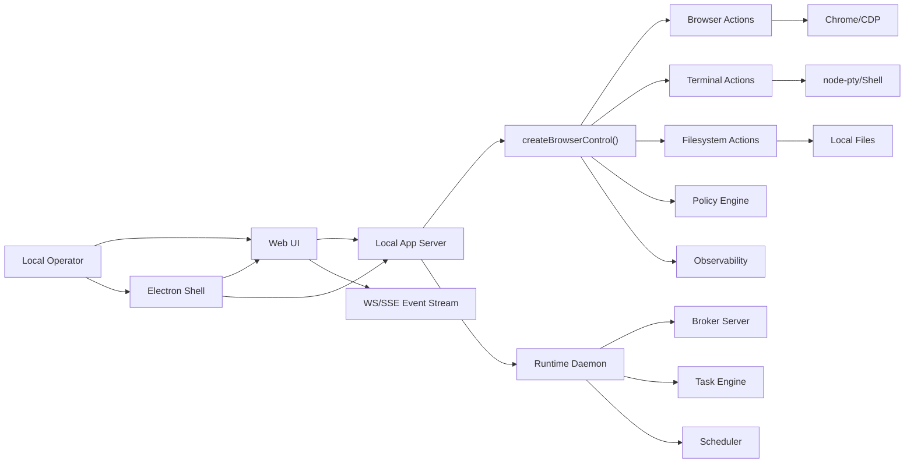
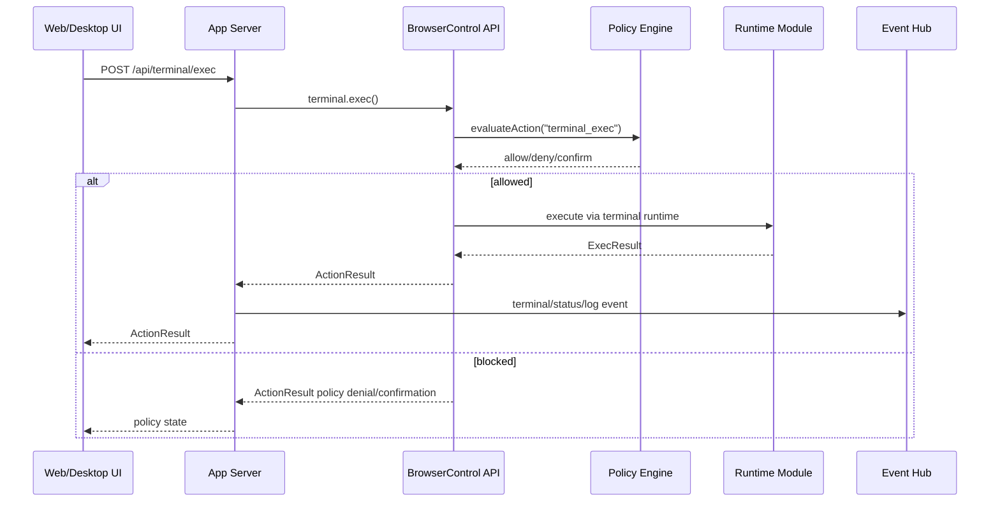

# Web and Desktop Wrapper Architecture

## Existing Architecture Summary

Browser Control is a local Node/TypeScript automation engine. Core surfaces:

- CLI in `src/cli.ts`
- TypeScript API in `src/browser_control.ts`
- MCP server in `src/mcp/server.ts` and `src/mcp/tool_registry.ts`
- daemon and broker in `src/runtime/daemon.ts` and `src/runtime/broker_server.ts`

Core paths:

- command path: terminal, filesystem, services, process/runtime
- a11y path: browser snapshots, refs, semantic actions
- low-level path: CDP/DOM/network fallback and observability

All public action surfaces return `ActionResult`.

## Proposed Architecture

Add a local app server and shared UI:

- `src/web/server.ts`: HTTP server lifecycle
- `src/web/routes.ts`: typed API routing
- `src/web/events.ts`: WebSocket/SSE event hub
- `src/web/security.ts`: local auth, CORS, CSRF/origin checks, bind guard
- `src/web/types.ts`: contracts shared with frontend
- `src/web/terminal_bridge.ts`: terminal sessions and stream events
- `src/web/browser_bridge.ts`: browser session/action API
- `src/web/task_bridge.ts`: task/scheduler API
- `src/web/log_bridge.ts`: logs/audit/debug evidence API
- `web/`: React/Vite dashboard
- `desktop/`: Electron shell

The app server should use `createBrowserControl()` for most runtime actions. It may call daemon/broker internals only where direct API coverage is missing.

## Component Diagram



## Data Flow Diagram



## Web UI to Runtime Flow

```text
React page -> api client -> local app server route -> createBrowserControl namespace -> policy/session/action module -> ActionResult -> route response + event hub
```

## Desktop UI to Runtime Flow

```text
Electron main -> start/connect app server -> BrowserWindow loads web UI -> renderer calls local app server with token -> same runtime flow as web
```

Electron main may own server child lifecycle. Renderer must not receive filesystem, shell, or process APIs.

## Terminal PTY Flow

```text
UI terminal panel -> POST /api/terminal/sessions -> TerminalActions.open -> daemon-backed TerminalRuntime -> node-pty
UI input -> POST /api/terminal/:id/input -> TerminalActions.type
output polling/stream -> TerminalActions.read/snapshot + event hub -> UI terminal rows
```

`src/terminal/render.ts` maps terminal snapshots to `BrowserTerminalView` for semantic rendering.

## Logs/Debug Evidence Flow

```text
Action failure -> collectFailureDebugMetadata -> debug bundle store
Browser action -> console/network capture -> observability store
Screencast -> receipt/timeline paths
App server -> redacted list/read endpoints -> UI evidence viewer
```

## Policy Enforcement Flow

Every privileged route maps to an action name already understood by `SessionManager.evaluateAction()` or `DefaultPolicyEngine`.

Required route behavior:

- deny: no side effect, return `ActionResult` denial
- require confirmation: no side effect until explicit confirmed flag/path is supported by underlying action
- allow/allow_with_audit: execute and include policy metadata

## Error Handling Model

- API errors use one schema: `{ success:false, error, code, details?, actionResult? }`
- Policy failures are `ActionResult` failures, not generic 500s.
- Backend exceptions are redacted.
- Frontend displays action, risk, policy decision, audit ID, debug bundle ID/path if present.
- Disconnected event stream shows reconnecting state and falls back to polling.

## Runtime Process Model

- Web dev: app server process + frontend dev server.
- Web production/local: one app server serving static built assets and API.
- Desktop: Electron main starts app server child or connects to existing one, then loads local URL.
- Daemon remains long-lived owner for terminal sessions and scheduled work.
- Browser Control runtime data remains under Browser Control data home.

## Runtime Storage Locations

- browser profiles: `~/.browser-control/profiles/`
- services registry: `~/.browser-control/services/registry.json`
- providers registry: `~/.browser-control/providers/registry.json`
- config: `~/.browser-control/config/config.json`
- logs: `~/.browser-control/logs/`
- debug bundles: `~/.browser-control/debug-bundles/`
- observability: `~/.browser-control/observability/`
- terminal buffers/session metadata: memory store keys managed by `TerminalBufferStore`
- daemon/broker interop: `~/.browser-control/.interop/`
- screenshots/downloads/session runtime files: runtime/session directories from `src/shared/paths.ts`
- tasks/schedules: daemon memory store and scheduler persistence
